<p align="center">
  
</p>

# 0xDragonHash

Web3 builder exploring Base, Robinhood-linked crypto research, wallet analytics, and terminal-native automation.

I build learning-first tools that help me understand how wallets, tokens, contracts, gas markets, and DeFi flows behave in real on-chain environments. My current focus is the Base ecosystem, practical on-chain dashboards, risk signals, and small bots that make network data easier to read from the terminal.

<p align="left">
  <a href="https://x.com/0xDragonHash"></a>
  
  
</p>

## Current Focus

- Base network tooling, wallet tracking, and developer experiments
- Robinhood crypto ecosystem research and market structure notes
- Terminal bots for gas, token, wallet, and contract intelligence
- Token risk signals, approvals, allowances, and DeFi safety patterns
- Learning in public through focused repos, clean READMEs, and practical demos

## Featured Projects

| Project | What it explores | Status |
| --- | --- | --- |
| `based-terminal-bot` | Live Base RPC CLI for chain status, wallet balance checks, and contract risk workflow | Working prototype |
| `base-wallet-tracker` | Base-first wallet intelligence model: balances, tx history, token exposure, labels | Product spec |
| `robinhood-chain-research` | Research lab for Robinhood crypto UX, retail flows, network support, and Base overlap | Research lab |
| `onchain-portfolio-dashboard` | Portfolio analytics architecture for wallet holdings, allocation, and network activity | Dashboard spec |
| `token-risk-scanner` | Risk framework for token ownership, minting, blacklist, tax, liquidity, and approvals | Security learning |
| `base-defi-playground` | DeFi sandbox for approvals, allowances, swaps, gas, router calls, and event logs | Sandbox |

## Technical Interests

```txt
RPC reads              eth_chainId, eth_blockNumber, eth_gasPrice, eth_getBalance
Wallet intelligence    address labels, watchlists, transaction grouping, token exposure
Risk review            owner roles, mint permissions, blacklist controls, approval exposure
Base research          gas behavior, low-fee UX, wallet onboarding, retail-friendly flows
Automation             terminal commands, polling bots, webhook alerts, JSON event logs
```

## Builder Stack

```txt
Networks       Base, EVM, Ethereum tooling
Contracts      Solidity, Foundry, Hardhat
Frontend       TypeScript, React, Next.js, Tailwind CSS
Backend        Node.js, API routes, CLI scripts
Data           RPC APIs, explorers, wallet events, token metadata
Research       Robinhood crypto, Base ecosystem, on-chain behavior
```

## Repository Map

```txt
based-terminal-bot          terminal-native Base assistant
base-wallet-tracker         wallet intelligence dashboard
robinhood-chain-research    Robinhood crypto research notes
onchain-portfolio-dashboard portfolio analytics UI
token-risk-scanner          token and contract risk signals
base-defi-playground        DeFi learning sandbox
wallet-activity-bot         wallet alert automation
dragonhash-labs             public learning notes and experiments
```

## What I Am Building Toward

My goal is to become sharper at reading on-chain systems from the builder side: not just charts, but wallets, contracts, allowances, bots, flows, and the data trails behind them. I keep my projects small, testable, and practical so each repo teaches one useful thing well.
